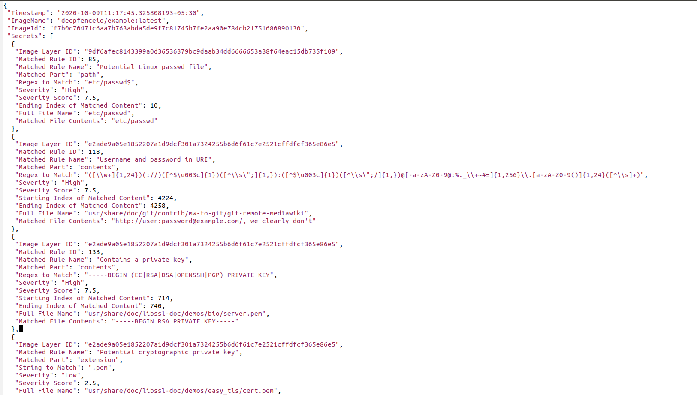

# What are Secrets?

Secrets are any kind of sensitive or private data which gives unauthorized users permission to access critical IT infrastructure (such as accounts, devices, network, cloud based services), applications, storage, databases and other kinds of critical data for an organization. For example, passwords, AWS access IDs, AWS secret access keys, Google OAuth Key etc. are secrets. Secrets should be strictly kept private. However, sometimes attackers can easily access secrets due to flawed security policies or inadvertent mistakes by developers. Sometimes developers use default secrets or leave hard-coded secrets such as passwords, API keys, encryption keys, SSH keys, tokens etc. in container images, especially during rapid development and deployment cycles in CI/CD pipeline. Also, sometimes users store passwords in plain text. Leakage of secrets to unauthorized entities can put your organization and infrastructure at serious security risk.
 
Deepfence SecretScanner helps users scan their container images or local directories on hosts and outputs a JSON file with details of all the secrets found.

Check out our [blog](https://medium.com/deepfence-cloud-native-security/detecting-secrets-to-reduce-attack-surface-3405ee6329b5) for more details.

# Command line options

## Running as a container

```
$ docker run -it --name=deepfence-secretscanner -v /var/run/docker.sock:/var/run/docker.sock -v /usr/bin/docker:/usr/bin/docker deepfenceio/secretscanning:latest

Usage of /home/deepfence/src/SecretScanner/SecretScanner:
  -config-path string
    	Searches for config.yaml from given directory. If not set, tries to find it from SecretScanner binary's and current directory
  -debug-level string
    	Debug levels are one of FATAL, ERROR, IMPORTANT, WARN, INFO, DEBUG. Only levels higher than the debug-level are displayed (default "ERROR")
  -image-name string
    	Name of the image along with tag to scan for secrets
  -local string
    	Specify local directory (absolute path) which to scan. Scans only given directory recursively.
  -max-multi-match uint
    	Maximum number of matches of same pattern in one file. This is used only when multi-match option is enabled. (default 3)
  -maximum-file-size uint
    	Maximum file size to process in KB (default 256)
  -multi-match
    	Output multiple matches of same pattern in one file. By default, only one match of a pattern is output for a file for better performance
  -temp-directory string
    	Directory to process and store repositories/matches (default "/tmp/Deepfence/SecretScanning")
  -threads int
    	Number of concurrent threads (default number of logical CPUs)

```

## Running on host

```
$ ./SecretScanner

Usage of ./SecretScanner:
  -config-path string
    	Searches for config.yaml from given directory. If not set, tries to find it from SecretScanner binary's and current directory
  -debug-level string
    	Debug levels are one of FATAL, ERROR, IMPORTANT, WARN, INFO, DEBUG. Only levels higher than the debug-level are displayed (default "ERROR")
  -image-name string
    	Name of the image along with tag to scan for secrets
  -local string
    	Specify local directory (absolute path) which to scan. Scans only given directory recursively.
  -max-multi-match uint
    	Maximum number of matches of same pattern in one file. This is used only when multi-match option is enabled. (default 3)
  -maximum-file-size uint
    	Maximum file size to process in KB (default 256)
  -multi-match
    	Output multiple matches of same pattern in one file. By default, only one match of a pattern is output for a file for better performance
  -temp-directory string
    	Directory to process and store repositories/matches (default "/tmp/Deepfence/SecretScanning")
  -threads int
    	Number of concurrent threads (default number of logical CPUs)

```

# Quick Try Using Docker

Install docker and run SecretScanner on a container image using the following instructions:

* Build SecretScanner: 

`docker build --rm=true --tag=deepfenceio/secretscanning:latest -f Dockerfile .` 

Or, pull the latest build from docker hub by doing: 

`docker pull deepfenceio/secretscanning`

* Pull a container image for scanning:

`docker pull node:8.11`

* Run SecretScanner: 
  * Scan a container image: 

    `docker run -it --name=deepfence-secretscanner -v /var/run/docker.sock:/var/run/docker.sock -v /usr/bin/docker:/usr/bin/docker deepfenceio/secretscanning:latest -image-name node:8.11`
  
  * Scan a local directory: 

    `docker run -it --name=deepfence-secretscanner -v /var/run/docker.sock:/var/run/docker.sock -v /usr/bin/docker:/usr/bin/docker deepfenceio/secretscanning:latest -local /home/deepfence/src/SecretScanner/test`

SecretScanner will also create json files with details of all the secrets found in the current working directory. In this case, output json files will be in the directory (/home/deepfence/output) inside the container.

# Build Instructions

1. Install Docker
2. Install Hyperscan
3. Install go for your platform (version 1.14)
4. Install go modules, if needed: `gohs`, `yaml.v3` and `color`
5. `go get github.com/deepfence/SecretScanner` will download and build SecretScanner automatically in `$GOPATH/bin` or `$HOME/go/bin` directory. Or, you can clone this repository and run `go build -v -i` to build the executable in the current directory.
6. Edit your config.yaml file as needed and run the secret scanner with the appropriate config file directory.

For reference, [Install file](https://github.com/deepfence/SecretScanner/blob/master/Install.Ubuntu) has the commands to build on ubuntu

# Instructions to Run on Local Host

```
./SecretScanner --help

./SecretScanner -config-path /path/to/config.yaml/dir -local test

./SecretScanner -config-path /path/to/config.yaml/dir -image-name node:8.11
```

# Sample Secrets Json Output



# Credits

We have built upon the configuration file from [shhgit](https://github.com/eth0izzle/shhgit) project.

# Disclaimer

This tool is not meant to be used for hacking. Please use it only for legitimate purposes like detecting secrets on the infrastructure you own, not on others' infrastructure. DEEPFENCE shall not be liable for loss of profit, loss of business, other financial loss, or any other loss or damage which may be caused, directly or indirectly, by the inadequacy of SecretScanner for any purpose or use thereof or by any defect or deficiency therein.


