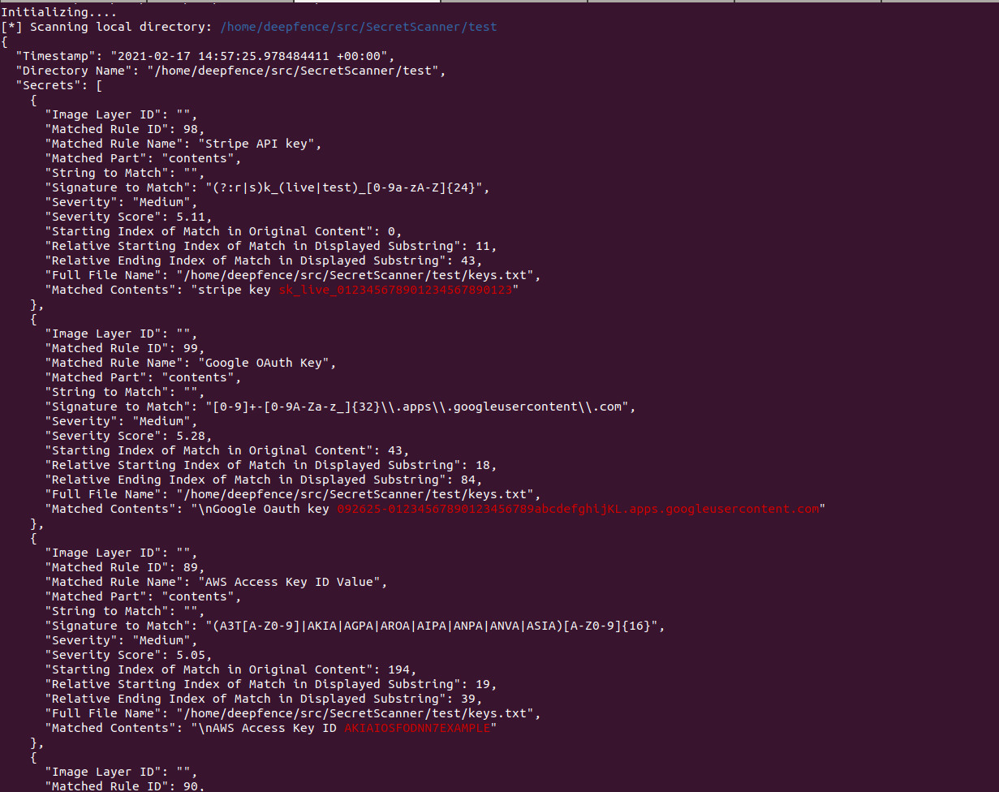

# SecretScanner

Deepfence can find unprotected secrets in container images or file systems.

* SecretScanner is a standalone tool that retrieves and searches container and host filesystems, matching the contents against a database of approximately 140 secret types.
* SecretScanner is also included in [ThreatMapper](https://github.com/deepfence/ThreatMapper), an open source scanner that identifies vulnerable dependencies and unprotected secrets in cloud native applications, and ranks these vulnerabilities based on their risk-of-exploit.

## What are Secrets?

Secrets are any kind of sensitive or private data which gives authorized users permission to access critical IT infrastructure (such as accounts, devices, network, cloud based services), applications, storage, databases and other kinds of critical data for an organization. For example, passwords, AWS access IDs, AWS secret access keys, Google OAuth Key etc. are secrets. 

## Sample SecretScanner Output

|  |
| :--: |
| *Sample SecretScanner JSON output* |

## When to use SecretScanner

Secrets should be strictly kept private. However, sometimes attackers can easily access secrets due to flawed security policies or inadvertent mistakes by developers. Sometimes developers use default secrets or leave hard-coded secrets such as passwords, API keys, encryption keys, SSH keys, tokens etc. in container images, especially during rapid development and deployment cycles in CI/CD pipeline. Also, sometimes users store passwords in plain text. Leakage of secrets to unauthorized entities can put your organization and infrastructure at serious security risk.

Deepfence SecretScanner scans container images or local directories on hosts and outputs a JSON file with details of all the secrets found.

## Credits

SecretScanner builds on the configuration file from [shhgit](https://github.com/eth0izzle/shhgit) project.